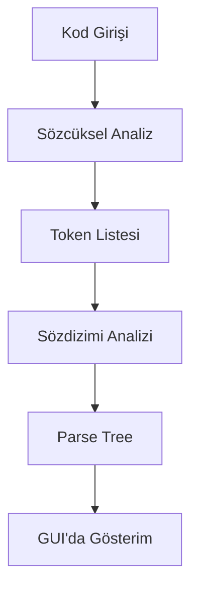

# C Dili Gerçek Zamanlı Sözdizimi Vurgulayıcı - Proje Dökümantasyonu

## Giriş
Bu proje, C programlama dilinde yazılmış kodların gerçek zamanlı olarak sözcüksel ve sözdizimsel analizini yapan, aynı zamanda sözdizimi vurgulaması (syntax highlighting) sağlayan bir masaüstü uygulamasıdır. Proje kapsamında, kullanıcıların yazdığı C kodu anında analiz edilmekte, kodun yapısı ve tokenları görsel olarak sunulmaktadır. Bu sayede hem eğitim hem de pratik amaçlı olarak C dilinin yapısal özellikleri kolayca anlaşılabilmektedir.

## Proje Amaçları
- C dilinin temel sözdizimi kurallarına uygun bir sözcüksel ve sözdizimsel analiz sistemi geliştirmek
- En az 5 farklı token türünü gerçek zamanlı olarak vurgulamak
- Kullanıcı dostu, modern ve etkileşimli bir arayüz sunmak
- Kodun hem tokenlara ayrılmış halini hem de sözdizimi ağacını (parse tree) görsel olarak göstermek
- Dökümantasyon ve rapor ile süreci akademik olarak belgelemek

---

## 1. Dil ve Gramer Seçimi
### 1.1. Neden C Dili?
C dili, hem eğitimde hem de endüstride yaygın olarak kullanılan, derleyici tabanlı, prosedürel bir programlama dilidir. Sembolik yapısı, açık grameri ve çok sayıda anahtar kelimesiyle sözcüksel ve sözdizimsel analiz için ideal bir örnektir.

### 1.2. Kullanılan Gramer
Projede, C dilinin temel yapılarını kapsayan, anlaşılır ve işlenebilir bir context-free grammar (bağlamdan bağımsız gramer) kullanılmıştır. Bu gramer, fonksiyon tanımı, değişken tanımı, atama, kontrol yapıları ve ifadeleri kapsar.

**Basitleştirilmiş C Grameri:**
```
program           -> statement_list
statement         -> declaration | function_definition | assignment | if_stmt | while_stmt | for_stmt | expression_stmt
declaration       -> type IDENTIFIER [= expression] ;
function_definition -> type IDENTIFIER ( [params] ) block
expression        -> simple_expression ([comparison_op] simple_expression)*
simple_expression -> term ((+|-) term)*
term              -> factor ((*|/) factor)*
factor            -> NUMBER | IDENTIFIER | STRING | ( expression )
```

**Not:** Bu gramer, C dilinin tamamını değil, temel yapılarını kapsayacak şekilde sadeleştirilmiştir. Gelişmiş C özellikleri (struct, pointer, dizi, fonksiyon işaretçisi vb.) bu projede kapsam dışıdır.

---

## 2. Sözdizimi Analiz Süreci
Sözdizimi analizi iki ana aşamadan oluşur:

### 2.1. Sözcüksel Analiz (Lexical Analysis)
Kod, anlamlı en küçük birimlere (token) ayrılır. Her token, tipine ve değerine göre sınıflandırılır. Yorumlar ve boşluklar analiz sırasında atlanır.

### 2.2. Sözdizimi Analizi (Syntax Analysis)
Token dizisi, belirlenen gramer kurallarına göre bir ağaç yapısına (parse tree) dönüştürülür. Bu ağaç, kodun yapısal ilişkilerini ve hiyerarşisini gösterir.

**Aşamaların Akış Diyagramı:**


---

## 3. Sözcüksel Analiz Detayları
### 3.1. Token Türleri
- **Anahtar Kelimeler (Keywords):** int, if, return, while, for, ...
- **Tanımlayıcılar (Identifiers):** Değişken ve fonksiyon isimleri
- **Operatörler (Operators):** +, -, *, /, =, ==, !=, <=, >=, &&, ||, ...
- **Sayılar (Numbers):** 42, 3.14, ...
- **Stringler (Strings):** "Merhaba"
- **Yorumlar (Comments):** // veya /* ... */
- **Ön İşlemci Direktifleri (Preprocessor):** #include, #define, ...
- **Ayraçlar (Delimiters):** (), {}, [], ;

### 3.2. Tokenization Yöntemi
- Python'da **düzenli ifadeler (regex)** ile her token türü için desenler tanımlanmıştır.
- Kod, soldan sağa taranır ve en uzun eşleşen desen öncelikli olarak token'a dönüştürülür.
- Yorumlar ve boşluklar atlanır.

**Örnek Tokenization:**
```c
int main() {
    int a = 5;
    a = a + 10;
    return 0;
}
```
| Token Tipi   | Değer   |
|--------------|---------|
| KEYWORD      | int     |
| IDENTIFIER   | main    |
| PAREN_OPEN   | (       |
| PAREN_CLOSE  | )       |
| BRACE_OPEN   | {       |
| KEYWORD      | int     |
| IDENTIFIER   | a       |
| OPERATOR     | =       |
| NUMBER       | 5       |
| SEMICOLON    | ;       |
| IDENTIFIER   | a       |
| OPERATOR     | =       |
| IDENTIFIER   | a       |
| OPERATOR     | +       |
| NUMBER       | 10      |
| SEMICOLON    | ;       |
| KEYWORD      | return  |
| NUMBER       | 0       |
| SEMICOLON    | ;       |
| BRACE_CLOSE  | }       |
```

---

## 4. Ayrıştırma (Parsing) Yöntemi
### 4.1. Yöntem Seçimi
- **Top-Down (Recursive Descent) Parser:**
  - Her gramer kuralı için ayrı bir fonksiyon yazılmıştır.
  - Parser, token listesini baştan sona dolaşır ve parse tree (sözdizimi ağacı) oluşturur.
  - Tanınmayan yapılar "UNKNOWN" olarak ağaçta gösterilir.

### 4.2. Parse Tree (Sözdizimi Ağacı)
- Her bir kod bloğu, parse tree'de bir dal olarak gösterilir.
- İfadeler (expression), aritmetik ve mantıksal işlemler, ağaçta hiyerarşik olarak gösterilir.

**Örnek Parse Tree (metinsel gösterim):**
```
Program
  FUNCTION_DEFINITION
    TYPE
      int
    NAME
      main
    BODY
      DECLARATION
        int
        IDENTIFIER
          a
        EXPRESSION
          NUMBER
            5
      ASSIGNMENT
        a
        OPERATOR
          =
        EXPRESSION
          SIMPLE_EXPRESSION
            IDENTIFIER
              a
            OPERATOR
              +
            NUMBER
              10
      RETURN_STATEMENT
        EXPRESSION
          NUMBER
            0
```

---

## 5. Vurgulama Şeması (Highlighting Scheme)
Kodda aşağıdaki token türleri farklı renklerle vurgulanır:

| Token Türü         | Renk      | Açıklama                       |
|--------------------|-----------|--------------------------------|
| Anahtar Kelime     | Mavi      | int, if, return, ...           |
| Tanımlayıcı        | Siyah     | main, a, counter, ...          |
| Operatör           | Kırmızı   | +, -, *, /, =, ==, ...         |
| Sayı               | Yeşil     | 42, 3.14, ...                  |
| String             | Turuncu   | "Merhaba"                      |
| Yorum              | Gri       | // yorum, /* ... */            |
| Ön İşlemci         | Mor       | #include, #define, ...         |

Bu renkler, kodun okunabilirliğini artırmak ve farklı yapıları kolayca ayırt etmek için seçilmiştir.

---

## 6. GUI (Arayüz) Uygulaması
### 6.1. Kullanılan Teknolojiler
- **Python 3**
- **Tkinter** (standart GUI kütüphanesi)

### 6.2. Arayüz Özellikleri
- **Kod Editörü:** Sol panelde, C kodu yazılabilir ve düzenlenebilir.
- **Sözdizimi Ağacı:** Sağ panelin üst kısmında, kodun parse tree'si (sözdizimi ağacı) gerçek zamanlı olarak gösterilir.
- **Token Listesi:** Sağ panelin alt kısmında, kodun tokenlara ayrılmış hali (lexical analysis sonucu) gösterilir.
- **Durum Çubuğu:** Kodun sözdizimi açısından geçerli olup olmadığı alt kısımda gösterilir.
- **Gerçek Zamanlı Vurgulama:** Kodda yapılan her değişiklik anında vurgulanır ve analizler güncellenir.
- **Klavye Kısayolları:** Kod editöründe temel kısayollar (kopyala, yapıştır, geri al, vs.) desteklenir.

### 6.3. Ekran Görüntüsü (Şematik)
```
+----------------------+-------------------------------+
|                      |  Syntax Analysis (Parse Tree) |
|                      |------------------------------|
|                      |  ...parse tree...            |
|   Kod Editörü        |------------------------------|
|                      |  Lexical Analysis (Token List)|
|                      |  ...token list...            |
+----------------------+-------------------------------+
|                Durum Çubuğu                          |
+------------------------------------------------------+
```

